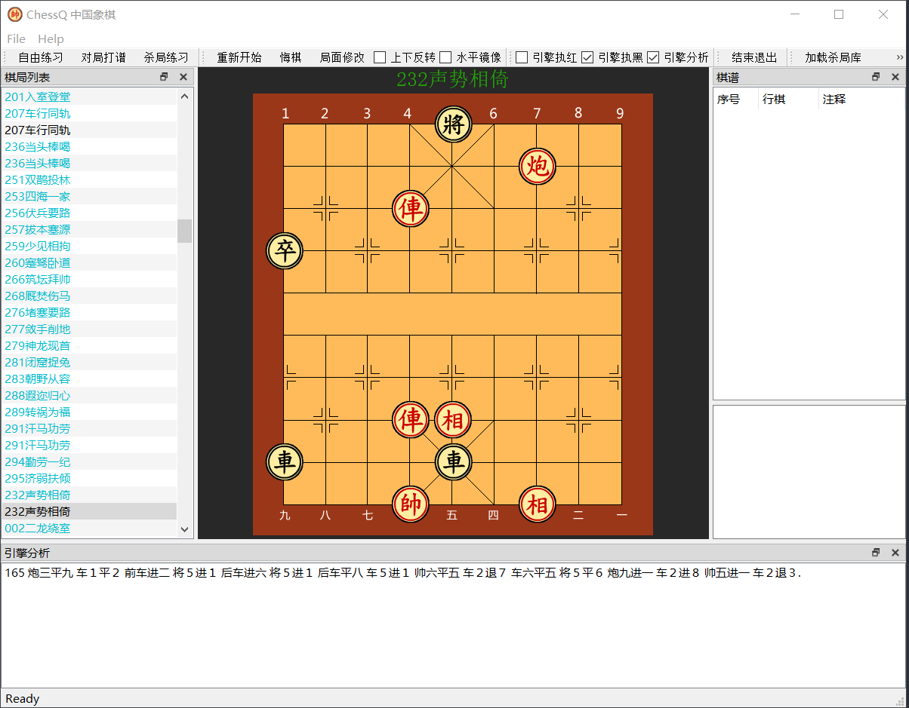

ChessQ是一个中国象棋程序。目前功能还很简单，目标是做个跨平台版的“象棋巫师”，希望在棋谱管理方面有自己独到的特色。

# 功能目标
 
- 对局/残局练习
  可以指定局面开始进行局面推演，支持纯手动操作、象棋引擎接管一方、以及象棋引擎全面掌管局面进行推演的操作。

- 杀局练习
   可以打开杀局谱，逐个杀法练习，保存练习进度。 	
   收录的杀法：	
  《基本杀法》
  《杀局谱》
  《梦入神机杀局》
  《适情雅趣360局》  
  
- 支持UCCI引擎
  可以加载支持UCCI协议的引擎，目前可以跨平台支持象棋巫师的“eleeye”（象眼）引擎，“Harmless”引擎（https://github.com/timebug/harmless）
  

ChessQ使用PyQT5编写，在windows下Python 3.7和PyQT 5.10 运行正常。

# 界面截图

欢迎加入一起完善这个小小的玩具，有任何问题和建议，欢迎反馈。
